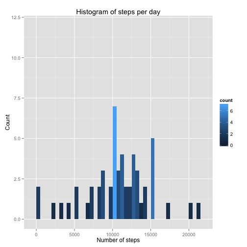

# Peer Assessment 1

It is now possible to collect a large amount of data about personal movement using activity monitoring devices such as a Fitbit, Nike Fuelband, or Jawbone Up. These type of devices are part of the "quantified self" movement -- a group of enthusiasts who take measurements about themselves regularly to improve their health, to find patterns in their behavior, or because they are tech geeks. But these data remain under-utilized both because the raw data are hard to obtain and there is a lack of statistical methods and software for processing and interpreting the data.

This assignment makes use of data from a personal activity monitoring device. This device collects data at 5 minute intervals through out the day. The data consists of two months of data from an anonymous individual collected during the months of October and November, 2012 and include the number of steps taken in 5 minute intervals each day.


```r
filename <- 'activity.zip'
fileurl <- 'https://d396qusza40orc.cloudfront.net/repdata%2Fdata%2Factivity.zip'
datafile <- 'activity.csv'

if (!file.exists(datafile)) {
  download.file(fileurl, filename, method = "curl")
  unzip(filename, exdir = '.')
}

data <- read.csv(datafile)
```

## What is mean total number of steps taken per day?


```r
library(ggplot2)
library(plyr)

s1 <- na.omit(data)
s1 <- ddply(s1, "date", summarise, "totalSteps" = sum(steps))

ggplot(s1, aes(x=totalSteps)) + geom_histogram(aes(fill = ..count..), binwidth=500) + ggtitle("Histogram of steps per day") + xlab("Number of steps") + ylab("Count") + ylim(0, 12)
```

 

```r
s1 <- s1[order(s1$totalSteps),]
meanSteps <- mean(s1$totalSteps)
medianSteps <- median(s1$totalSteps)
```

Mean total number of steps taken per day: ``10766.19``

Median total number if steps taken per day: ``10765``

## What is the average daily activity pattern?


```r
s2 <- na.omit(data)
s2 <- ddply(s2, "interval", summarise, "averageSteps" = mean(steps))

ggplot(s2, aes(x=interval, y=averageSteps)) + geom_line() + xlab("Interval") + ylab("Number of steps") + ggtitle("Average steps per interval")
```

 


```r
maxInterval = s2[which.max(s2$averageSteps),1]
```
####Which 5-minute interval, on average across all the days in the dataset, contains the maximum number of steps? ``835``

## Missing data

Replace missing data with the average number of steps for that interval.


```r
missingRows <- sum(is.na(data))
```

Total number of rows with NAs: ``2304``


```r
f<-data

impute.mean <- function(x) replace(x, is.na(x), mean(x, na.rm = TRUE))
f <- ddply(data, .(interval), transform, steps = impute.mean(steps))

s3 <- ddply(f, "date", summarise, "totalSteps" = sum(steps))

ggplot(s3, aes(x=totalSteps)) + geom_histogram(aes(fill = ..count..), binwidth=500) + ggtitle("Histogram of steps per day with no NAs") + xlab("Number of steps") + ylab("Count") + ylim(0, 12)
```

 

```r
s3 <- s3[order(s3$totalSteps),]
meanSteps <- mean(s3$totalSteps)
medianSteps <- median(s3$totalSteps)
```

Mean total number of steps taken per day: ``10766.19``

Median total number if steps taken per day: ``10766.19``


#### Do these values differ from the estimates from the first part of the assignment? 

Mean is the same, but median now equals the mean.

#### What is the impact of imputing missing data on the estimates of the total daily number of steps?

The histogram was the same shape, but the total daily number of steps shows an increased count for some values.

Replacing missing data caused a few daily step counts to increase, but preserved the distribution of the histogram.  The mean remained the same, but the median increased to match the mean.

## Are there differences in activity patterns between weekdays and weekends?


```r
library(lattice)

f$days <- sapply(f$date, function(x) { 
  day = weekdays(as.Date(x, "%Y-%m-%d")) 
  if ( day == "Saturday" || day == "Sunday") { 
    x = "weekend" 
  } 
  else { 
    x = "weekday" 
  }
})

f1 <- ddply(f, .(days, interval), summarise, "averageSteps" = mean(steps))

xyplot(averageSteps~interval|days, data = f1, type = "l", horizontal=TRUE, layout = c(1, 2), xlab="Interval", ylab="Number of steps", main="Steps per interval - weekend vs weekday")
```

 

